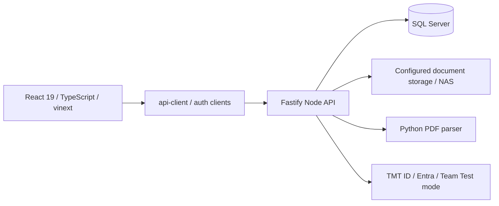

# Architecture — source boundaries

[Context index](../../AGENTS.md)

Evidence baseline: `1e58594b`, 2026-09-12. This page is curated; generated cards are refreshed separately. Source topology is high confidence. Runtime configuration and full business acceptance require separate verification.

## Entry points

| Responsibility | Source | Read when |
|---|---|---|
| Main page | [app/page.tsx](../../app/page.tsx) | Selecting real application entry |
| Navigation, session restore, permission-filtered screens | [ProductionApp.tsx](../../app/system/ProductionApp.tsx) | New menu / login / cross-module navigation |
| HTTP DTOs and client functions | [api-client.ts](../../app/system/api-client.ts) | API shape or frontend request changes; search path first |
| Common UI and language | [ui.tsx](../../app/system/ui.tsx), [i18n.ts](../../app/system/i18n.ts) | Shared widgets, TH/EN/JP |
| Startup | [server.ts](../../backend-node/src/server.ts) | Listen configuration and migration startup |
| API registration | [app.ts](../../backend-node/src/app.ts) | Route wiring, middleware, read-only gate |
| Configuration / DB / identity | [config.ts](../../backend-node/src/config.ts), [db.ts](../../backend-node/src/db.ts), [auth.ts](../../backend-node/src/auth.ts), [users.ts](../../backend-node/src/users.ts) | Environment, SQL access or authorization changes |
| SQL schema | [Schema index](SCHEMA.md) | Migration and relational contracts |
| Files | [document-storage.ts](../../backend-node/src/document-storage.ts) | Upload, download, path validation and storage keys |
| PDF extraction | [pdf-parser/main.py](../../pdf-parser/main.py) | Supplier quotation extraction |

## Request and change boundaries

Navigation refresh: `ProductionApp.restoreWorkspace` restores the last top-level view after authentication/bootstrap, using per-tab `sessionStorage` keyed by user ID. `lib/remembered-view.ts` prioritizes explicit support/activity/certificate links and validates remembered views against current permissions. Unknown or disallowed views fall back to Dashboard; logout clears the stored view. Storage denial must not block login. Master Data leaf destinations and the operational/summary report destinations have distinct view IDs and are restored; legacy master resolves to customers. Other nested tabs, selected records and unsaved forms are not restored. Navigation groups follow child permissions; rate access additionally uses canViewEngineeringRates. Regression coverage: `tests/remembered-view.test.mjs` and `tests/auth-restoration.test.mjs`.

1. A production screen calls a function in api-client.ts. Navigation may use the ProductionApp view state, so routes.ts alone is not the active-menu inventory.
2. Fastify applies authentication and configured middleware. Route handlers resolve current user permissions and record scope; visible menus do not confer write authorization.
3. Business helpers validate inputs, workflow and monetary invariants. Writes may use transactions, rowVersion and audit. Inspect the selected path rather than assuming every endpoint enforces identical rules.
4. Structured records reside in SQL Server. Files use document-storage; their metadata and bytes have different lifecycles.
5. The screen reloads or updates state from the API result. Changing a DTO requires checking its callers as well as its route.

## Important domain boundaries

- Estimate section/discipline, source ledger, ERP category and assigned owner are separate concepts. Do not merge these into one enum or infer access from department alone.
- Copy Estimate is transactional, preserves source data and existing target assignments, and resolves internal labor against the live rate master. Start at [copy](modules/estimate-copy.md).
- ERP classifications are revision-scoped. Summary/export must reconcile all contributing ledgers and overhead. Start at [ERP](modules/estimate-erp.md).
- ERP mapping UI: [EstimateErpSummary.tsx](../../app/system/production/EstimateErpSummary.tsx) supports selection/bulk drafts, search and filters, grouped subtotals and discard. Suggestions from [erp-category-suggest.ts](../../lib/erp-category-suggest.ts) require review and an explicit save; OtherCostLine and Contingency always stay manual. Export remains blocked while drafts are unsaved. Check [suggestion tests](../../tests/erp-category-suggest.test.mjs) and [workbook tests](../../tests/erp-estimate-workbook.test.mjs) for changes here.
- Labor package defaults are reusable inputs; applying them is not permission to copy historical internal rates. Start at [labor](modules/labor.md).
- Signing, resource task workflow and report approval overlap but have distinct identity and state rules. Read both module cards when changing the handoff.

## Runtime versus repository

The last verified deployment in this conversation was GitHub Deploy #94 at `1e58594b`; readiness reported schema 44 and available document storage. This is historical evidence, not a perpetual health guarantee.

The Mac deploy script uses docker-compose.dev.yml plus docker-compose.tls.yml. The frontend service runs `npm run dev`; a successful local production build does not prove that the hosted frontend runs a production build. See [compose](../../docker-compose.dev.yml), [deploy script](../../scripts/macos/deploy.sh) and [workflow](../../.github/workflows/deploy.yml).

Push to main triggers Deploy directly. CI has its own branch/event filters; do not equate successful deployment with successful CI. The workflow's `production` environment label does not prove a reviewer gate is configured in GitHub.

`backend/` is the earlier .NET implementation; `backend-php/`, `worker/`, demo screens and alternative hosting configs are separate paths. Check registration and compose before changing them. Never infer current database identity, address, secret or mode from old release notes.
