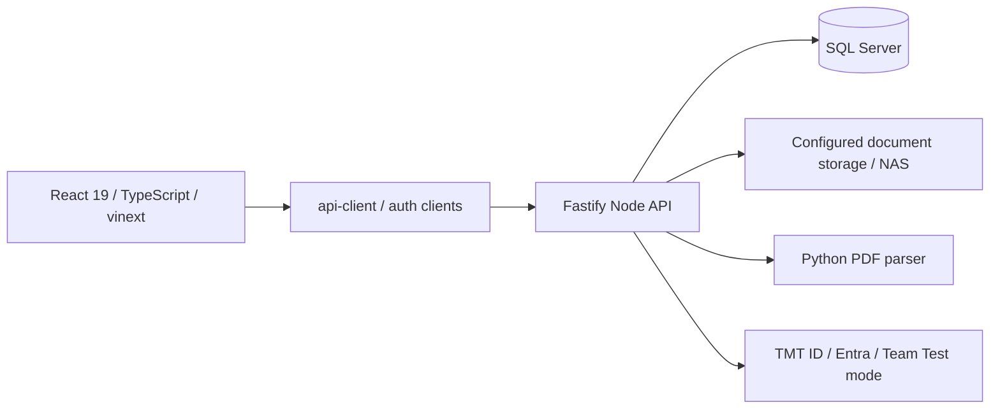

# Architecture — source boundaries

[Context index](../../AGENTS.md)

Evidence baseline: `1e58594b`, 2026-09-12. This page is curated; generated cards are refreshed separately. Source topology is high confidence. Runtime configuration and full business acceptance require separate verification.

```mermaid
flowchart LR
  UI[React 19 / TypeScript / vinext] --> Client[api-client / auth clients]
  Client --> API[Fastify Node API]
  API --> SQL[(SQL Server)]
  API --> Storage[Configured document storage / NAS]
  API --> Parser[Python PDF parser]
  API --> Identity[TMT ID / Entra / Team Test mode]
```

## Entry points

| Responsibility | Source | Read when |
|---|---|---|
| Main page | [app/page.tsx](../../app/page.tsx) | Selecting real application entry |
| Navigation, session restore, permission-filtered screens | [ProductionApp.tsx](../../app/system/ProductionApp.tsx) | New menu / login / cross-module navigation |
| HTTP DTOs and client functions | [api-client.ts](../../app/system/api-client.ts) | API shape or frontend request changes; search path first |
| Common UI and language | [ui.tsx](../../app/system/ui.tsx), [i18n.ts](../../app/system/i18n.ts) | Shared widgets, TH/EN/JP |
| Startup | [server.ts](../../backend-node/src/server.ts) | Listen configuration and migration startup |
| API registration | [app.ts](../../backend-node/src/app.ts) | Route wiring, middleware, read-only gate |
| Configuration / DB / identity | [config.ts](../../backend-node/src/config.ts), [db.ts](../../backend-node/src/db.ts), [auth.ts](../../backend-node/src/auth.ts), [users.ts](../../backend-node/src/users.ts) | Environment, SQL access or authorization changes |
| SQL schema | [Schema index](SCHEMA.md) | Migration and relational contracts |
| Files | [document-storage.ts](../../backend-node/src/document-storage.ts) | Upload, download, path validation and storage keys |
| PDF extraction | [pdf-parser/main.py](../../pdf-parser/main.py) | Supplier quotation extraction |

## Request and change boundaries

Navigation refresh: `ProductionApp.restoreWorkspace` restores the last top-level view after authentication/bootstrap, using per-tab `sessionStorage` keyed by user ID. `lib/remembered-view.ts` prioritizes explicit support/activity/certificate links and validates remembered views against current permissions. Unknown or disallowed views fall back to Dashboard; logout clears the stored view. Storage denial must not block login. Master Data leaf destinations and the operational/summary report destinations have distinct view IDs and are restored; legacy master resolves to customers. Other nested tabs, selected records and unsaved forms are not restored. Navigation groups follow child permissions; rate access additionally uses canViewEngineeringRates. Regression coverage: `tests/remembered-view.test.mjs` and `tests/auth-restoration.test.mjs`.

Code splitting: screens off the landing path are `next/dynamic` boundaries in [LazyScreens.tsx](../../app/system/production/LazyScreens.tsx), each with its own loading state and a chunk-failure panel that offers a reload. CoreScreens (Dashboard), PlanningPricingScreens (My Work) and everything they import statically stay in the first load. A static import of a lazy module from an eager one silently puts it back; [tests/lazy-screens.test.mjs](../../tests/lazy-screens.test.mjs) guards this.

1. A production screen calls a function in api-client.ts. Navigation may use the ProductionApp view state, so routes.ts alone is not the active-menu inventory.
2. Fastify applies authentication and configured middleware. Route handlers resolve current user permissions and record scope; visible menus do not confer write authorization.
3. Business helpers validate inputs, workflow and monetary invariants. Writes may use transactions, rowVersion and audit. Inspect the selected path rather than assuming every endpoint enforces identical rules.
4. Structured records reside in SQL Server. Files use document-storage; their metadata and bytes have different lifecycles.
5. The screen reloads or updates state from the API result. Changing a DTO requires checking its callers as well as its route.

## Important domain boundaries

- Estimate section/discipline, source ledger, ERP category and assigned owner are separate concepts. Do not merge these into one enum or infer access from department alone.
- Copy Estimate is transactional, preserves source data and existing target assignments, and resolves internal labor against the live rate master. Start at [copy](modules/estimate-copy.md).
- ERP classifications are revision-scoped. Summary/export must reconcile all contributing ledgers and overhead. Start at [ERP](modules/estimate-erp.md).
- Cost list & ERP mapping UI: [EstimateErpSheet.tsx](../../app/system/production/EstimateErpSheet.tsx) is the Estimate "summary" tab — the ERP sheet built from [estimate-cost-breakdown.ts](../../lib/estimate-cost-breakdown.ts) and [erp-estimate-groups.ts](../../lib/erp-estimate-groups.ts): classify lines (single or bulk), merge and split ERP groups, and export the workbook from the sheet's own rows. Internal labor takes its category automatically ([erp-category-suggest.ts](../../lib/erp-category-suggest.ts) `automaticLaborCategory`); every other category is a person's explicit choice. Check [ERP group tests](../../tests/erp-estimate-groups.test.mjs) and [workbook tests](../../tests/erp-estimate-workbook.test.mjs) for changes here.
- Cost item entry type-ahead: Item code / Description / Brand in the quick row and the detail modal search `GET /api/v1/estimates/cost-item-lookup` ([estimate-cost-lookup.ts](../../backend-node/src/routes/estimate-cost-lookup.ts): current-revision `cost_items` of every estimate + `supplier_price_history`, one row per distinct part, `estimate.read`); a pick fills the whole line via [cost-item-lookup.ts](../../lib/cost-item-lookup.ts) with the same price-source rule as the Price Library. Supplier is a filtered combobox over the bootstrap supplier list ([CostItemLookup.tsx](../../app/system/production/CostItemLookup.tsx)).
- Labor package defaults are reusable inputs; applying them is not permission to copy historical internal rates. Start at [labor](modules/labor.md).
- Signing, resource task workflow and report approval overlap but have distinct identity and state rules. Read both module cards when changing the handoff.
- Site Monitor has two callers. `/api/v1/monitor/agent/*` is used by TMT Control Panel on customer machines: these routes are `config.public` (no signed-in person) and authenticate with the `X-Agent-Key` header, stored only as a SHA-256 hash in `dbo.monitor_agents`. Everything else under `/api/v1/monitor/*` is the screen and uses `monitor.read` / `monitor.control` / `monitor.manage`. Web start/stop/restart is a queued `dbo.monitor_commands` row that the agent long-polls; it never reaches the machine directly. The sweeper in [site-monitor.ts](../../backend-node/src/site-monitor.ts) (one per process, 30 s) marks silent agents offline, expires commands and emails the site's responsible people 1 → 2 → 3; every email is preceded by an atomic claim in SQL, so several API processes on one database never send the same email twice. The incident rules (unexpected stop only, one open incident per program) are in the heartbeat SQL of [routes/site-monitor.ts](../../backend-node/src/routes/site-monitor.ts).

## Runtime versus repository

The last verified deployment in this conversation was GitHub Deploy #94 at `1e58594b`; readiness reported schema 44 and available document storage. This is historical evidence, not a perpetual health guarantee.

The Mac deploy script uses docker-compose.dev.yml plus docker-compose.tls.yml. The TLS overlay builds the frontend image from the root [Dockerfile](../../Dockerfile) (`vinext build`, served by `vinext start`) and requires `DEV_API_AUTH_MODE=TmtId` / `DEV_FRONTEND_AUTH_MODE=tmt-id`; plain docker-compose.dev.yml remains the local bind-mounted `npm run dev` stack. A Vite dev server answers any path under the project root, so it must never be the shared-host frontend. See [compose](../../docker-compose.dev.yml), [TLS overlay](../../docker-compose.tls.yml), [deploy script](../../scripts/macos/deploy.sh) and [workflow](../../.github/workflows/deploy.yml).

Push to main runs CI; Deploy starts from CI's `workflow_run` and only when CI succeeded for that push (manual `workflow_dispatch` bypasses it). The workflow's `production` environment label does not prove a reviewer gate is configured in GitHub.

Removed on 2026-10-05 and not to be restored: the .NET API (`backend/`), `docker-compose.prod.yml` + `scripts/linux/`, `backend-php/`, the `/demo` prototype on in-repo sample data, and the Vercel/nitro/OpenAI-sites hosting scaffolds. `worker/index.ts` stays only because the Cloudflare Vite plugin hosts vinext's RSC environment. Never infer current database identity, address, secret or mode from old release notes.
